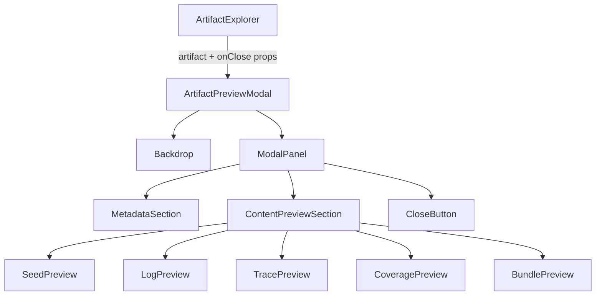

# Design Document: Artifact Preview Modal

## Overview

The Artifact Preview Modal is a self-contained React component that renders a full-screen overlay when a user clicks the preview action on an artifact row in the Artifact Explorer. It displays artifact metadata and a type-specific simulated content preview inline, without navigating away from the dashboard.

The component lives in a single new file:
`apps/web/src/app/implement-artifact-preview-modal-component.tsx`

It uses only React 19 and Tailwind CSS v4 — both already present in `apps/web/package.json`. No new dependencies are introduced and no existing files are modified.

---

## Architecture

The modal is a pure presentational component. State (whether the modal is open, which artifact is selected) is owned by the parent (e.g. `ArtifactExplorer`). The modal receives the selected artifact and an `onClose` callback as props.



### Rendering Strategy

The modal is rendered via a React Portal into `document.body` so it sits above all stacking contexts. The backdrop is a fixed full-screen `div`; the panel is centered using flexbox.

### Focus Management

On mount, focus is moved to the close button (or the panel itself). A `keydown` listener on the panel traps Tab/Shift+Tab within focusable elements. On unmount, focus returns to the element that triggered the modal (the Preview_Trigger button).

### Scroll Lock

`document.body.style.overflow = 'hidden'` is set on mount and restored on unmount via a `useEffect` cleanup.

### Escape Key

A `keydown` listener on `document` fires `onClose` when `key === 'Escape'`.

---

## Components and Interfaces

### `ArtifactPreviewModal` (default export)

```ts
interface ArtifactPreviewModalProps {
  artifact: Artifact;
  onClose: () => void;
}
```

Renders the backdrop + panel. Handles:
- Scroll lock (useEffect)
- Escape key listener (useEffect)
- Backdrop click → onClose
- Focus trap (useEffect + ref to panel)
- aria-modal, aria-labelledby

### `ArtifactContentPreview` (internal)

```ts
interface ArtifactContentPreviewProps {
  artifact: Artifact;
}
```

Switches on `artifact.type` and renders the appropriate preview sub-component.

### Preview sub-components (internal, inline)

| Type | Renderer | Output |
|---|---|---|
| `seed` | `SeedPreview` | Hex-dump style monospace block |
| `log` | `LogPreview` | Scrollable monospace code block |
| `trace` | `TracePreview` | Formatted JSON monospace code block |
| `coverage` | `CoveragePreview` | Summary table / text block |
| `bundle` | `BundlePreview` | Hex-dump style monospace block |

### `Artifact` type (re-used from existing codebase)

The component imports and re-uses the `Artifact` interface already defined in `add-artifact-explorer.tsx`. Since that file does not export the type, the new file will redeclare it locally (identical shape) to avoid modifying existing files.

```ts
interface Artifact {
  id: string;
  name: string;
  type: 'seed' | 'log' | 'trace' | 'coverage' | 'bundle';
  size: number;
  updatedAt: string;
  runId?: string;
  content_hash?: string;
}
```

---

## Data Models

### Props

```ts
// Artifact — mirrors the shape in add-artifact-explorer.tsx
interface Artifact {
  id: string;
  name: string;
  type: 'seed' | 'log' | 'trace' | 'coverage' | 'bundle';
  size: number;        // bytes
  updatedAt: string;   // ISO 8601
  runId?: string;
  content_hash?: string;
}

interface ArtifactPreviewModalProps {
  artifact: Artifact;
  onClose: () => void;
}
```

### Simulated Preview Content

Content previews are deterministically generated from the artifact's metadata (id, size, type). No network calls are made. Each type has a dedicated generator function:

| Type | Generator output |
|---|---|
| `seed` / `bundle` | Hex rows derived from artifact id bytes |
| `log` | Multi-line log text with timestamps |
| `trace` | JSON object with execution steps |
| `coverage` | Object with line/branch/function coverage percentages |

### Formatting Utilities

- `formatSize(bytes: number): string` — same logic as in `add-artifact-explorer.tsx`, redeclared locally
- `formatDate(iso: string): string` — uses `Intl.DateTimeFormat`

---

## Correctness Properties

*A property is a characteristic or behavior that should hold true across all valid executions of a system — essentially, a formal statement about what the system should do. Properties serve as the bridge between human-readable specifications and machine-verifiable correctness guarantees.*

### Property 1: Metadata completeness

*For any* artifact with all required fields (name, type, size, updatedAt), the rendered modal panel should contain the artifact's name, type label, human-readable size, and formatted timestamp.

**Validates: Requirements 2.1**

### Property 2: Content hash conditional display

*For any* artifact that has a `content_hash` value, the rendered modal panel should contain that hash string; for any artifact without a `content_hash`, the hash section should be absent.

**Validates: Requirements 2.2**

### Property 3: Run ID conditional display

*For any* artifact that has a `runId`, the rendered modal panel should display that run ID; for any artifact without a `runId`, the panel should display a placeholder indicating no associated run.

**Validates: Requirements 2.3**

### Property 4: Content preview present for all types

*For any* artifact of any valid type (`seed`, `log`, `trace`, `coverage`, `bundle`), the rendered modal panel should contain a non-empty content preview section.

**Validates: Requirements 3.1**

### Property 5: Log and trace use monospace code block

*For any* artifact of type `log` or `trace`, the rendered preview element should be a `<pre>` or `<code>` element (monospace block).

**Validates: Requirements 3.2, 3.3**

### Property 6: Seed and bundle use hex-dump preview

*For any* artifact of type `seed` or `bundle`, the rendered preview should contain hex-formatted content (characters matching `[0-9a-f]` in groups).

**Validates: Requirements 3.4**

### Property 7: Scroll lock round-trip

*For any* artifact, mounting the modal should set `document.body.style.overflow` to `'hidden'`, and unmounting it should restore the original overflow value.

**Validates: Requirements 1.3, 4.4**

### Property 8: Escape key closes modal

*For any* open modal, dispatching a `keydown` event with `key === 'Escape'` should invoke `onClose` exactly once.

**Validates: Requirements 4.2**

### Property 9: Backdrop click closes modal

*For any* open modal, a click event on the backdrop element (not the panel) should invoke `onClose` exactly once.

**Validates: Requirements 4.3**

### Property 10: aria-modal and aria-labelledby present

*For any* artifact, the rendered modal panel should have `aria-modal="true"` and an `aria-labelledby` attribute referencing an element that contains the artifact's name.

**Validates: Requirements 5.3**

### Property 11: formatSize unit correctness

*For any* non-negative integer byte count, `formatSize` should return a non-empty string containing a numeric value and one of the unit suffixes `B`, `KB`, or `MB`.

**Validates: Requirements 2.1** (human-readable size display)

---

## Error Handling

| Scenario | Handling |
|---|---|
| `artifact` prop is `null` / `undefined` | Component renders nothing (guard at top of render) |
| Unknown `artifact.type` | `ArtifactContentPreview` renders a generic "unsupported type" message |
| `updatedAt` is not a valid ISO string | `formatDate` catches the error and returns the raw string |
| Portal target (`document.body`) unavailable (SSR) | `useEffect` guard: portal only mounts client-side |

---

## Testing Strategy

### Dual Testing Approach

Both unit tests and property-based tests are required for comprehensive coverage.

**Unit tests** cover:
- Rendering the modal with each artifact type and verifying the correct preview sub-component appears
- Verifying the close button calls `onClose`
- Verifying `aria-modal` and `aria-labelledby` attributes are present
- Verifying scroll lock is applied on mount and removed on unmount
- Edge cases: artifact with no `runId`, artifact with no `content_hash`

**Property-based tests** cover the Correctness Properties listed above.

### Property-Based Testing Library

Use **fast-check** (`npm install --save-dev fast-check`) for property-based testing in the TypeScript/Jest environment already configured in `apps/web`.

Each property test must run a minimum of **100 iterations**.

Tag format for each test:
```
// Feature: artifact-preview-modal, Property <N>: <property_text>
```

### Property Test Mapping

| Property | Test description |
|---|---|
| P1 | Generate random artifacts; render modal; assert name/type/size/date present |
| P2 | Generate artifacts with/without content_hash; assert hash shown/hidden |
| P3 | Generate artifacts with/without runId; assert runId shown or placeholder shown |
| P4 | Generate artifacts of each type; assert preview section non-empty |
| P5 | Generate log/trace artifacts; assert rendered element is `<pre>` or `<code>` |
| P6 | Generate seed/bundle artifacts; assert preview contains hex characters |
| P7 | Render modal; mount and unmount; assert overflow set then restored |
| P8 | Render modal; dispatch Escape keydown; assert onClose called once |
| P9 | Render modal; click backdrop; assert onClose called once |
| P10 | Generate random artifacts; render modal; assert aria attributes present |
| P11 | Generate random byte counts; assert formatSize returns valid string with unit |

### Unit Testing Balance

Avoid duplicating property test coverage in unit tests. Unit tests should focus on integration points (e.g. the full render tree for one artifact of each type) and error/edge conditions (null artifact, unknown type). Property tests handle the broad input space.
